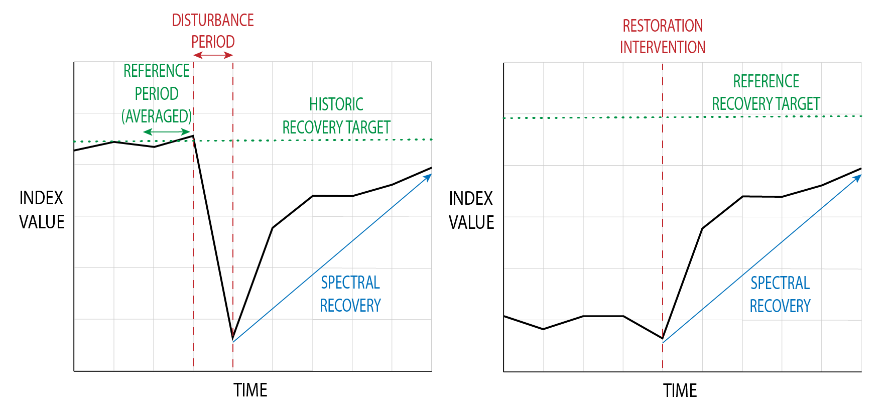

# 1. INTRODUCTION

**Authors:**

Melissa Birch

**Reviewed/Edited by:**

Sarah Zwiep

Marcos Kavlin

Dr. Andy Dean

Dr. Nicholas Coops

This user guide provides an overview of the Spectral Recovery tool. In the first half of the user guide, there is a review of the theoretical use of spectral recovery, which covers:

1. The basic approach of using remote sensing techniques for monitoring ecosystem recovery.
2. Previous work that has been done in this area.
3. The use of recovery targets.
4. Interpreting spectral recovery in an ecological context.

In the second half of this document, the tool, its inputs, and guide for its use is discussed.

## 1.1 ECOSYSTEM RESTORATION

Growing anthropogenic activity and global climate change is resulting in increased disturbances and degradation of natural environments (Suding et al., 2015). The subsequent goals of conservation, adaptation, and mitigation are putting greater emphasis on both improvement and monitoring of ecosystems (Wortley et al., 2013). As a result, ecosystem restoration efforts, which aim to restore an area to a specified condition, and can involve passive, active, or hybrid regeneration techniques (Burnett et al., 2019; Hobbs & Norton, 1996) are becoming more widespread.

Restoration has proven to be an effective tool to reverse ecosystem damage, while also increasing ecosystem resilience (Wortley et al., 2013). At the same time, an important outcome of restoration interventions has often been an increased functionality of ecosystems, and a greater availability of ecosystem goods and services (Atkinson et al., 2022; Hobbs & Norton, 1996). Because of the numerous potential benefits, the specific goals of restoration may differ between sites including aspects such as increasing carbon storage or timber quality, with restoration techniques often tailored to reach those specific goals (Burnett et al., 2019). Depending on the restoration goals, the success of the ecosystem recovery is usually determined by measures of one or more categories of ecosystem characteristics: vegetation structure, biodiversity, and ecological functioning (Ruiz-Jaen & Mitchell Aide, 2005).

Monitoring restoration efforts typically involve field measurements, which can be expensive and infeasible, especially if the restoration site is inaccessible or covers large spatial extents. Especially challenging for effective monitoring is the ability to repeat the field measurements over time, to ensure that restoration efforts are still on track. These limitations often result in an incomplete understanding of the recovery process, with most restoration monitoring programs having durations of five years or less (Ruiz-Jaen & Mitchell Aide, 2005). Yet recovery often occurs on much longer timescales, with biodiversity and structural regeneration requiring upwards of seven years to show progress (Chen et al., 2011; Pickell et al., 2016; Atkinson et al., 2022).

Remote sensing offers a potential aid for these limitations, with open access, and operationally ready satellite data products allowing consistent, inexpensive, and repeatable measurements of ground conditions at a landscape scale (Cordell et al., 2017).  To date remote sensing techniques have not been used as frequently as field measurements, due in part to cost, access and the typical focus of fine scale site specific recovery strategies (Cordell et al., 2017). However, the increased emphasis on ecosystem restoration and management being landscape-focused (Cordell et al., 2017) makes remote sensing highly applicable to restoration monitoring frameworks.

## 1.2 USING SPECTRAL INDICES TO MONITOR RESTORATION OUTCOMES

Freely available satellite imagery has resulted in advancements in the use of remote sensing data products and algorithms for monitoring the conditions of vegetation (Wulder et al., 2012), with a substantial number of analyses depending on spectral indices. Sometimes referred to as vegetation indices, spectral indices use reflectance from two or more spectral bands to produce an estimate of vegetation health (Zeng et al., 2022). Spectral indices have a long history as proxies for vegetation condition (Banskota et al., 2014) and have been correlated to a wide variety of ecosystem variables, such as ecosystem structure or function (Skidmore et al., 2021), enabling their use in estimating ecosystem recovery. For example, the Normalized Difference Vegetation Index (NDVI) is frequently used to monitor growing conditions and has been shown to correlate with leaf area index (LAI) (Zeng et al., 2022); whilst the Normalized Burn Ratio (NBR) is commonly used to assess vegetation conditions following wildfire, and is related to vegetation productivity and water stress (Key and Benson, 2006).

Spectral indices are commonly used in time series analyses (Banskota et al., 2014) which assess how spectral indices change over time, often pre and post disturbance events, resulting in a spectral trajectory. By revealing how these indices have changed (in other words, by using the trajectories), it enables the characterization of disturbances, recovery, or both (Wulder et al., 2019). Subsequently, one can use these trajectories to calculate change metrics, such as change magnitude or change duration (Banskota et al., 2014; Wulder et al., 2019). Recent developments in the use of spectral information for ecosystem recovery detection have also resulted in a variety of recovery metrics that have proven to be useful for characterizing recovery specifically, such as Years to Recovery (Y2R) (Wulder et al., 2019; Frazier et al., 2018, De Keersmaecker et al., 2022). Along with these metrics, change algorithms have also been developed, however these are often complex, require parameterization, and are inaccessible to users unfamiliar with remote sensing or statistics (Cohen et al., 2018).

## 1.3 LOOKING AT RECOVERY TRAJECTORIES

Generally, there are two main components of recovery that should be considered: recovery rate and recovery trajectory or shape (Montoya, 2021). Recovery rates and trajectories are often considered in remote sensing analyses, but they are hard to estimate when using ground data. This is primarily because revealing the rate and trajectory shape require repeated measurements of the conditions, which would be expensive to monitor using field data. Yet, recovery rates and trajectories reveal substantial information about the progress of the recovery, as it shows not only how quickly a site is recovering, but also how that rate is changing over time. It is this information offered by rates and trajectories that can be used for the calculation of recovery metrics, which consequently offer more information about recovery progress than a simple index value.

  

_Figure 1. Displays two conceptual spectral recovery trajectories, following a disturbance and using a historical recovery target (A), and following a restoration intervention with a reference recovery target (B)._

A second consideration is timescales. There can be short-term and long-term recovery indicators, with some spectral indices providing information about short-term recovery and some indices providing more information about long-term recovery. For example, NDVI often increases quite quickly in the restoration process as it is sensitive to vegetation like grasses and shrubs, which often establish themselves rapidly after a disturbance (Hislop et al., 2018; Pickell et al., 2016). However, NDVI also saturates or plateaus at relatively low biomass densities (Chu et al., 2016; Pickell et al., 2016; White et al., 2017), so it may not provide much information as a long-term recovery indicator. NBR, on the other hand, has been shown to correlate more with vegetation structure, and is thus often used to estimate the re-establishment of trees or woody vegetation, as opposed to grasses (Frazier et al., 2015; Hislop et al., 2018; Pickell et al., 2016; White et al. 2017). Both indices provide complementary insight into the recovery progress of a site, and it is recommended to look at both short-term and long-term recovery indicators for this reason.

Recovery trajectories following restoration can be variable, often being a nonlinear process that experiences interannual variation (Ruiz-Jaen & Mitchell Aide, 2005). In fact, the first five years of a restoration project may see highly divergent trajectories across the site, due to stochasticity, variations in climate, and other highly localized environmental variables and processes (Matthews & Spyreas, 2010). This is especially true with the increasingly rapid climate changes due to anthropogenic activities (Suding et al., 2015). Because of this interannual variation, a trajectory may change year-to-year, which is why it is recommended to run the tool annually to assess the recovery progress. However, it is also expected that there will be variability in the spectral trajectories, and a decreased recovery rate for a single year may not be cause for concern.

Spectral trajectories often differ with disturbance severity and disturbance types (Bright et al., 2019; Chen et al., 2011; Chu et al., 2016; Schroeder et al., 2011), or local environment such as the amount of precipitation that is received, or differences in previous land cover, soils, nutrient availabilities, and ecosystem types (Epting & Verbyla, 2005; Frazier et al., 2015; Frolking et al., 2009; Kennedy et al., 2012). Spectral trajectories can also vary by forest type or dominant species (Frazier et al. 2015; Bright et al., 2019). For example, Morresi et al. (2019) found that broadleaved trees recovery more quickly than conifers. Spectral indices will also display different trajectories (Cohen et al., 2018; Pickell et al., 2016) so it is important to consider what information each index offers as an ecological indicator, and be aware of its limitations. Altogether these differences indicate a key reason why this tool, which monitors individual areas through time using multiple indices, is necessary for understanding forest restoration and recovery, as generalizations across both time and space cannot be made.

## 1.4 RECOVERY TARGETS

A necessary component of monitoring restoration success is having an appropriate recovery target for a restoration site (Hobbs & Norton, 1996; Ruiz-Jaen & Mitchell Aide, 2005). In the field of ecological restoration, it is expected to have clearly defined and measurable target ecosystem attributes (Hobbs & Norton, 1996), which identify the degree of recovery desired for the degraded area (Gann et al., 2019). The most common approach for measuring restoration success, is to measure the similarity between the restoration site and these recovery targets (Hobbs & Norton, 1996). The field of remote sensing also frequently estimates restoration success by assessing similarity of a restoration site to a recovery target condition, via the comparison of spectral index values to pre-disturbance conditions (Frazier et al., 2018; White et al., 2017).

This tool provides customization, as it allows recovery targets to be set with two common approaches outlined below.

DETERMINING THE RECOVERY TARGET USING A HISTORICAL APPROACH

A historical approach uses a historical condition of a restoration site as the recovery target. This is the most common approach in the field of remote sensing, with the readily available satellite imagery in the Landsat archives dating back to 1984 making it possible to select a historical recovery target. Support for this approach has grown as there has been increasing freely available historic satellite imagery, with Sentinel-2 imagery's earliest historical period being 2016. In annual time series trajectory analyses, the recovery target is frequently set by taking the average spectral value of the two years prior to the start of the disturbance (De Keersmaecker et al., 2022; Pickell et al., 2016; White et al., 2017). As spectral trajectories can be noisy and subject to interannual variation, the average is taken to represent the general pre-disturbance condition and offset any potential noise in the spectral trajectory of those two years (Pickell et al., 2016). This logic is the basis of the default recovery target method used in the tool, however this default method can be customized to fit each application. Custom options include the ability to manually set the timeframe (when and how many years) before the disturbance that is used to calculate the average historic condition. This could be useful to parameterize if the disturbance was gradual instead of sudden and so no exact disturbance dates exist, or if it is known due to historical, traditional, or local knowledge when the forest was in a desirable state.

DETERMINING THE RECOVERY TARGET USING A REFERENCE APPROACH

A recommended approach for determining recovery targets within the field of ecological restoration is the use of reference systems (Gann et al., 2019). Reference systems are areas within the same landscape of the restoration site which exhibit desirable ecosystem attributes and represent a healthy or stable ecosystem condition (Gann et al., 2019). These are often attributed to be natural or semi-natural ecosystems which could have been similar to the restoration site's state if not for the site's degradation or disturbance (Gann et al., 2019). The use of reference systems is built on the recognition that within an ecosystem, there are multiple possible meta-states depending on environmental drivers such as climate or species which may affect the successional dynamics, and that ecosystems are always in a state of change (Gann et al., 2019; Hobbs & Norton, 1996). Ecological restoration frameworks strongly encourage the use of reference systems over historical conditions, as the latter target might be impossible or even undesirable to reach. This is primarily due to changes in biotic and abiotic conditions, especially in the context of climate change and the importance of ecosystem resilience (Gann et al., 2019). Yet, to determine restoration successful, a target is still required which is where reference systems become integral.

By incorporating a number of reference systems into the recovery target, it allows for a range of dynamic conditions making restoration success more feasible (Hobbs & Norton, 1996). It also helps to avoid any potential bias in reference system selection, as choosing one may result in only the highest quality site being chosen (which may be unattainable) or failure to include systems that that experience the same conditions as the restoration site (Atkinson et al. 2022).

The tool's reference approach to determining a recovery target is similar to the historical approach in that it uses the values of spectral indices. However, instead of taking the average value of pre-disturbance conditions, the recovery target is determined by the average index value across the reference sites at the current timestep. This means that the recovery progress of the restoration site is compared to the current and contextual conditions within the landscape.

## 1.5 RECOVERY METRICS

Recovery metrics allow for the characterization or spectral trends through time, using the spectral trajectories to result in standardized and comparable numeric variables (Wulder et al., 2019). There are five recovery metrics currently implemented within the tool, which are each informed by previous research (De Keersmaecker et al., 2022; Frazier et al., 2018; Pickell et al., 2016; White et al., 2017).

A choice of metrics is included to make the outputs applicable to different research or monitoring objectives, and offer differing information. ∆Indexregrowth quantifies the absolute change during a restoration window, whilst YrYr uses this absolute change to derive an average annual rate of change. R80P allows for the quantification of recovery progress relative to a recovery target, while the Y2R metric reveals how long it took for the recovery process to occur. RRI is distinct from other metrics, as it relates the change during the restoration window to the change due to the disturbance, essentially scaling the recovery to the disturbance severity (Frazier et al., 2018). Thus, the tool's range of metrics can offer complementary information concerning a restoration site's recovery.

This tool produces raster outputs that allow for the visualization of per-pixel recovery metrics. This enables a clear understanding of the recovery progress across an entire landscape. Subsequent spatial analyses using these tool outputs can include measures of spatial autocorrelation with external variables, cluster analyses, or measures of spatial heterogeneity. This could prove useful to identifying any spatial patterns or trends in recovery in the landscape, or the potential to identify which external factors (such as restoration treatments, topography, soil, dominant species, precipitation, etc.) are more significant drivers of ecological recovery. Conversely, this can also aid in the identification of areas that could require further restoration activities to aid in the recovery process.

The tool also provides per-polygon recovery metrics, which summarize the progress of the restoration site as a whole. This informs on how well the recovery is progressing generally and includes measures such as percent recovered. Percent of a restoration site recovered could be a valuable measure of success by itself, as restoration practitioners may simply require a certain percentage (e.g., 80%) of a restoration site to reach recovery target values to determine that no further management efforts are necessary.

# 2. THE SPECTRAL RECOVERY TOOL
## 2.1 TOOL OVERVIEW AND PURPOSE

The objective of the PEOPLE-ER Spectral Recovery tool is to provide an open-source and satellite earth observation (EO) time series data analytics solution for ecosystem restoration research and monitoring purposes, which operates with freely available Sentinel-2 or Landsat satellite imagery. The aim is to provide custom analyses ideal for widespread applications beyond site-specific contexts, with flexible reference conditions enabling direct integration with current ecosystem restoration initiatives and guidelines. The tool provides flexible methods for satellite EO data time series analysis, by providing users with the ability to select from a variety of spectral indices and recovery metrics as well as define reference or baseline conditions. The ability to calculate multiple per-pixel indices allows spectrally derived products useful for further analysis to be produced by users that do not necessarily have a background in remote sensing. In providing a singular solution, spectral time series analysis becomes more approachable, increasing the opportunity to apply remote sensing techniques to ecosystem restoration monitoring.

## 2.2 TOOL WORKFLOW

The tool operates using the following approach:

1. The tool utilizes annual composites of satellite images, over the focus sites, from either Landsat or Sentinel-2 image data. Spectral indices are calculated for each pixel within each restoration site, for each year of the time series. This results in each pixel having a set of spectral trajectories through time.

1. Based on these, the tool compares the spectral trajectories to a recovery target (defined from the period prior to disturbance or a reference location).

1. Recovery metrics for each pixel are calculated based on the recovery trajectory and the recovery target. This informs on how well each pixel is recovering after disturbances or during the restoration process.

_Figure 2. Tool conceptual workflow diagram._

## 2.3 TOOL INPUTS

Necessary inputs for the tool include a time series composite, covering one or more restoration sites, a selection of spectral indices, and a selection of recovery metrics. An optional input to the tool is one or more reference sites. These inputs are explained below, and more information concerning the formats required for the tool inputs can be found in the tool's Technical Documentation.

## 2.4 TIME SERIES COMPOSITE

A time series composite must be:

- Satellite-derived annual raster images – The spectral index calculation currently supports Landsat imagery post 1984. It is recommended that the time series composite be derived using Landsat Collection 2, Level 2, Tier 1 data, as this data is pre-processed prior with necessary corrections and represents the highest quality data available. See ([https://www.usgs.gov/landsat-missions/landsat-collection-2](https://www.usgs.gov/landsat-missions/landsat-collection-2) or Crawford et al., 2023) for further information. Updates to the tool will include the incorporation of Sentinel-2 imagery.

- Multi-spectral bands in the Visible, Near infrared and Short wave infrared – The spectral index calculations depend on reflectance bands in the visible (blue, green, red), near infrared (NIR), and shortwave infrared (SWIR 1 and 2).
- Annual – The tool requires one image per year, as the calculation of the recovery metrics depend on an annual timestep.
- Cloud-free – The time series composite should have been pre-processed to ensure that pixels containing clouds and snow have been removed. A commonly used algorithm is Fmask (see Zhu et al., 2015), however there are numerous cloud-masking algorithms available for different software (Zhu, 2017).

Recommendations:

- A best available pixel (BAP) composite – A BAP combines the highest quality and/or most appropriate pixels (based on selection criteria such as target date) from available satellite imagery from a given year. For more information on BAP composites, see Hermosilla et al. (2016) or White et al. (2014).

- A tool to create a BAP composite using Google Earth Engine called BAP-GEE exists [here](https://github.com/saveriofrancini/bap), accompanied by a research paper by Francini et al. (2023). BAP-GEE provides an easily accessible user interface to aid in a rapid BAP composite creation, providing yearly .tif image files for download.

## 2.5 RESTORATION SITES

The tool accepts one restoration site, as a vector file (see technical documentation for further information). Restoration site polygons delineate the areas that are intended to be assessed for recovery or health (i.e., areas of disturbance). Each restoration site polygon will have the spectral indices calculated, and recovery metrics will be returned.

 Recommendations:

- Larger restoration site polygons (containing 1000s of pixels) will be expected to have within site variability in vegetation conditions and recovery rates. The tool allows for raster-based visualization of indicators, but the spectral recovery graphs are per-polygon and will show the average for the site. Since recovery is often variable even within a small area, it is recommended to consider the size of the polygons for the analysis. It may be beneficial to stratify a single large restoration polygon into multiple smaller polygons. This may be more effective for revealing distinct trends, reduce variability of the recovery metrics for polygons, and provide more information about spatial heterogeneity. This means that it is also easier to identify areas of the landscape that may be recovering faster or slower than average.

- When stratifying a larger polygon into multiple polygons, consider using factors that are expected to influence recovery, e.g., disturbance severity, climate, and pre-disturbance land cover or conditions (Atkinson et al., 2022), it may be useful to stratify the polygons according to one or more of these factors.

## 2.6 SPECTRAL INDICES

The tool requires a list of spectral indices that should be calculated. Currently, the tool offers 13 indices.

| Index | Name | Formula | Ecological significance and information |
| --- | --- | --- | --- |
| NDVI | Normalized Difference Vegetation Index | $(NIR – Red) \over( NIR + Red)$ | Most commonly used index in recovery, typically associated with photosynthesis, growing condition, or "greenness" (Vogelmann et al., 2012; Zeng et al., 2022). Ranges from -1 to 1, with \>0.6 indicating very good conditions (Mangewa et al., 2022). Sensitive to soil brightness and saturates at higher biomass levels (around 0.85 NDVI value) (Huete et al., 2002). |
| GNDVI | Green Normalized Difference Vegetation Index | $(NIR - Green) \over (NIR + Green)$ | Larger dynamic range than NDVI, meaning less sensitive to saturation at higher biomass levels and more sensitive to chlorophyll content (Gitelson et al., 1996). \>0.5 indicates very good condition (Mangewa et al., 2022) |
| NBR | Normalized Burn Ratio | $(NIR - SWIR2) \over (NIR + SWIR2)$ | Increases with greater productive or more vegetative areas and decreases with water stress and dead vegetation, with greater positive values indicating greater productivity (Key and Benson, 2006). Sensitive to vegetation structure and higher levels of 'woody' vegetation (Pickell et al., 2016). |
| EVI | Enhanced Vegetation Index | $2.5 * [(NIR - Red) \over (NIR + 6 * Red - 7.5 * Blue + 1)]$ | Alternative to NDVI to minimize atmospheric effects, less likely to saturate and more appropriate for densely vegetated areas (Huete et al., 2002; Zeng et al., 2022). More sensitive than NDVI for needleleaf canopy structures (Huete et al., 2002). Ranges from 0-1 with 1 indicating better vegetation conditions. |
| AVI | Advanced Vegetation Index | $[NIR * (1 – Red)*(NIR – Red)]^{1/3}$ | Found to be positively correlated with forest density and able to differentiate between forest types, shrubs, and grasses however may be most appropriate for deciduous forests (Roy et al., 1996). |
| SAVI | Soil-Adjusted Vegetation Index | $[(NIR - Red) / (NIR + Red + 0.5)] * 1.5$ | Alternative to NDVI to minimize the effect of soil background, so is more appropriate in sparsely vegetated areas (Huete, 1988; Zeng et al., 2022). |
| TCG | Tasseled Cap Greenness | $0.2043 * Blue + 0.4158 * Green + 0.5524 * Red + 0.5741 * NIR + 0.3124 * SWIR1 + 0.2303 * SWIR2$ | Sensitive to subtle changes in vegetation condition and related to forest cover (Sonnenschein et al., 2011) and can be used to predict forest successional stages (Song et al., 2002). |
| TCW | Tasseled Cap Wetness | $0.1509 * Blue + 0.1973 * Green + 0.3279 * Red + 0.3406 * NIR + 0.7112 * SWIR1 + 0.4572 * SWIR2$ | Found to be highly effective for recovery detection (Banskota et al., 2014; Cohen et al., 2010), and can be used to predict forest successional stages (Song et al., 2002). |
| SR | Simple Ratio Index | $NIR \over Red$ | Related to vegetation structure, biomass, and chlorophyll content, but is sensitive to atmospheric effects (Tucker 1979; Zeng et al., 2022). |
| NDMI | Normalized Difference Moisture Index | $(NIR - SWIR1) \over (NIR + SWIR1)$ | Useful in areas frequently exposed to drought or experiencing changes in climate as it is sensitive to changes in vegetation moisture content; Ranges from -1 to 1 with lower values indicating water stress (Taloor et al., 2021; Zeng et al., 2022). Also related to vegetation structure and biomass (Latifovic & Pouliot, 2014). |
| GCI | Green Chlorophyll Index | $(NIR / Green) - 1$ | Found to be positively correlated with species abundance (Kumar et al., 2018), and provides an estimate of canopy chlorophyll content that has shown to be related to leaf area index as well as biomass (Gitelson et al., 2003). |
| NDII | Normalized Difference Infrared Index | $(SWIR1 - NIR) \over (SWIR1 + NIR)$ | Reveals hydrological condition of canopies, but may be less sensitive at lower moisture levels (Hardisky et al., 1983; Verbesselt et al., 2007; Yilmaz et al., 2008). |

## 2.7 RECOVERY METRICS

The tool calculates the selected recovery metrics as identified in an input list. Recovery metrics are calculated for each pixel in the restoration polygons, for each spectral index chosen.

| Variable  | Description  |
| --- | --- |
| Ds  | Index value: Disturbance start  |
| De  | Index value: Disturbance end  |
| Dpre  | Index value: Pre-disturbance (average of 2 years prior to Ds)  |
| Daverage  | Index value: average value from Ds to De  |
| R0  | Index value: Restoration start (usually 1 year after De)  |
| Ri  | Index value: years after R0, subscripts indicate the # of years  |
| Rcurrent  | Index value: current time step or last year of time series  |
| Rtarget  | Index value: recovery target  |
| Rslope  | Recovery slope/rate  |
| P  | Percent, user-defined, default is 80  |
| t  | Years/time step  |

| Metric | Formula | Description |
| --- | --- | --- |
| ∆Indexregrowth |$R_i−R_0$  Default:  $R_5−R_0$| The absolute change in a spectral index's value at a point in the restoration monitoring window from the start of the restoration monitoring window. The default is the change that has occurred 5 years into the restoration from the start of the restoration.|
| YrYr(Year on year average) |$R_i - R_0 \over \Delta _t R_i - R_0$   Default:   $R_5 - R_0 \over 5$| The average annual recovery rate relative to a fixed time interval during the restoration monitoring window. The default is the first 5 years of the restoration window, however this can be changed by specifying the index value at a specific time step (Ri). |
| R80P (Ratio of 80 percent) |$Rcurrent \over Rtarget * P$  OR  $max(R_5,R_4) \over Rtarget * P$  Default:  $Rcurrent \over Rtarget * 0.8$| The extent to which the trajectory has reached 80% of the recovery target value. The metric commonly uses the maximum value from the 4th or 5th year of restoration window to show the extent to which a pixel has reached 80% of the target value 5 years into the restoration window, however for monitoring purposes, this tool uses the current time step or last year of the time series to provide up to date recovery progress. 80% of the recovery target value is the default, however this can be changed by modifying the value of P. |
| Y2R (Years to recovery) | $i where R_i= Rtarget*P$   Default:  $i where R_i= Rtarget*0.8$| The length of time taken (in time steps/years) for a given pixel to reach 80% of its recovery target value. The percent can be modified by changing the value of P. |
| RRI (Relative recovery index) |$max(R_5,R_4)-R_0 \over D_s-D_e$| A modified version of the commonly used RI, the RRI accounts for noise in trajectory by using the maximum from the 4th or 5th year in monitoring window. The metric relates recovery magnitude to disturbance magnitude, and is the change in index value in 4 or 5 years divided by the change due to disturbance. |

## 2.8 REFERENCE SITES

The tool accepts an optional input of one or more reference sites, as vector files (see technical documentation for further information). Reference site polygons delineate the areas that are intended to be used to determine the recovery target. In other words, these are areas of the landscape which are known to either be relatively healthy, stable, or have desired traits, which the restoration sites will be compared against. Each reference site polygon will have the spectral indices calculated, and the average value across the reference sites for each spectral index will be the recovery target value for that index. If no reference sites are provided, the recovery target is calculated via the default historical method (i.e., using average historical spectral values of the restoration site).

Recommendations:

- In areas that have seen large landscape disturbances, there may be a lack of appropriate reference systems. In that case, it is recommended to use areas that have either seen the least disturbance or degradation, or areas which have had the longest time to recover.
- Often it is tempting to pick only the very highest quality reference sites, however these are often areas which are relatively undisturbed which may provide biased and/or unattainable targets (Atkinson et al. 2022). They could fail to experience the actual range of conditions seen in the restoration site or they could include entirely different target ecological communities (Atkinson et al. 2022). Try to select areas which have similar histories (e.g., land cover) as well as similar micro-climates.

- Select multiple reference systems to provide a dynamic range of ecosystem attributes for the recovery targets.

## 2.9 TOOL CONSIDERATIONS AND LIMITATIONS

This section aims to outline some recommended key considerations and transparent discussion of the tool's limitations.

The use of satellite imagery may underestimate or overestimate recovery due to its spatial resolution relative to the spatial structure of vegetation recovery processes. Mangewa et al. (2022) found that habitat conditions were underestimated using Sentinel-2 10 m satellite imagery compared with approximately 8.5 cm resolution aerial-based imagery, also finding that while satellite imagery was able to detect the class of very good habitat conditions successfully, it was not as able to detect the poor or very poor condition classes. Generally, the result due to mixed pixels, is an overestimation of moderate condition vegetation (Mangewa et al., 2022). While using the tool, it is beneficial to keep in mind the resolution of the data and the implications for detail the imagery can reveal. Depending on the habitat, Sentinel-2 may offer advantages in revealing spatial heterogeneity of recovery that is not possible with Landsat.

Spectral indices have long been proven effective at estimating the conditions of vegetation (Huete et al., 2002; Key & Benson, 2006; Vogelmann et al., 2012; Zeng et al., 2022), however they provide an estimation of vegetation health using spectral indices as a proxy as opposed to a direct measurement of a recovery attribute such as vegetation height or stem density. Thus, the outputs of the tool should be validated using ground measurements, or external datasets such as those derived from LiDAR. For instance, rapid recovery of NDVI could indicate that native or natural vegetation is returning to an area after disturbance, but it could also mean that an invasive species has taken advantage of a lack of competition, which would then result in slower recovery rates and the disruption of successional stages (Burnett et al., 2019). However, a study by White et al. (2022) found that spectral recovery (of NBR) was successful in predicting recovery of structural attributes such as canopy cover and tree height, so it is still reasonable to assume relative accuracy in recovery estimation using multiple spectral indices.

Some spectral indices may not be appropriate due to geographical locations of the study sites or their ecosystems, or even due to the satellite images available. It is encouraged to research the use of each index for specific ecosystems and forest types to ensure compatibility and efficacy in results.

It is advisable to be critical in the interpretation of the results. Positive change in a spectral index does not necessarily equal recovery (as in the invasive species example mentioned above), and consistently high measures of the indices may not be desirable either. For example, if the aim of the restoration is to improve biodiversity and species richness, then it is perhaps more desirable for there to be variability in the spectral indices across the landscape. Variability in NDVI values, for instance, have shown to be correlated to habitat heterogeneity (Gould, 2000).

Generally, the individual goals of each restoration project vary, and so the interpretation of the results should subsequently vary. The tool allows for a better general understanding of landscape conditions, with different spectral indices providing differing information. The tool output could be used in a subsequent analysis, with different data such as soil, climate, species, or habitat information overlaid, to further identify recovery progress in light of environmental variables.

# 3 ACKNOWLEDGEMENTS AND REFERENCES

Atkinson, J., Brudvig, L. A., Mallen-Cooper, M., Nakagawa, S., Moles, A. T., & Bonser, S. P. (2022). Terrestrial ecosystem restoration increases biodiversity and reduces its variability, but not to reference levels: A global meta-analysis. _Ecology Letters_, _25_(7), 1725–1737. [https://doi.org/10.1111/ele.14025](https://doi.org/10.1111/ele.14025)

Banskota, A., Kayastha, N., Falkowski, M. J., Wulder, M. A., Froese, R. E., & White, J. C. (2014). Forest Monitoring Using Landsat Time Series Data: A Review. _Canadian Journal of Remote Sensing_, _40_(5), 362–384. [https://doi.org/10.1080/07038992.2014.987376](https://doi.org/10.1080/07038992.2014.987376)

Bright, B. C., Hudak, A. T., Kennedy, R. E., Braaten, J. D., & Henareh Khalyani, A. (2019). Examining post-fire vegetation recovery with Landsat time series analysis in three western North American forest types. _Fire Ecology_, _15_(1), 8. [https://doi.org/10.1186/s42408-018-0021-9](https://doi.org/10.1186/s42408-018-0021-9)

Burnett, K. M., Ticktin, T., Bremer, L. L., Quazi, S. A., Geslani, C., Wada, C. A., Kurashima, N., Mandle, L., Pascua, P., Depraetere, T., Wolkis, D., Edmonds, M., Giambelluca, T., Falinski, K., & Winter, K. B. (2019). Restoring to the future: Environmental, cultural, and management trade-offs in historical versus hybrid restoration of a highly modified ecosystem. _Conservation Letters_, _12_(1), e12606. [https://doi.org/10.1111/conl.12606](https://doi.org/10.1111/conl.12606)

Chen, X., Vogelmann, J. E., Rollins, M., Ohlen, D., Key, C. H., Yang, L., Huang, C., & Shi, H. (2011). Detecting post-fire burn severity and vegetation recovery using multitemporal remote sensing spectral indices and field-collected composite burn index data in a ponderosa pine forest. _International Journal of Remote Sensing_, _32_(23), 7905–7927. [https://doi.org/10.1080/01431161.2010.524678](https://doi.org/10.1080/01431161.2010.524678)

Chu, T., Guo, X., & Takeda, K. (2016). Remote sensing approach to detect post-fire vegetation regrowth in Siberian boreal larch forest. _Ecological Indicators_, _62_, 32–46. [https://doi.org/10.1016/j.ecolind.2015.11.026](https://doi.org/10.1016/j.ecolind.2015.11.026)

Cohen, W. B., Yang, Z., Healey, S. P., Kennedy, R. E., & Gorelick, N. (2018). A LandTrendr multispectral ensemble for forest disturbance detection. _Remote Sensing of Environment_, _205_, 131–140. [https://doi.org/10.1016/j.rse.2017.11.015](https://doi.org/10.1016/j.rse.2017.11.015)

Cohen, W. B., Yang, Z., & Kennedy, R. (2010). Detecting trends in forest disturbance and recovery using yearly Landsat time series: 2. TimeSync — Tools for calibration and validation. _Remote Sensing of Environment_, _114_(12), 2911–2924. [https://doi.org/10.1016/j.rse.2010.07.010](https://doi.org/10.1016/j.rse.2010.07.010)

Cordell, S., Questad, E. J., Asner, G. P., Kinney, K. M., Thaxton, J. M., Uowolo, A., Brooks, S., & Chynoweth, M. W. (2017). Remote sensing for restoration planning: How the big picture can inform stakeholders. _Restoration Ecology_, _25_(S2), S147–S154. [https://doi.org/10.1111/rec.12448](https://doi.org/10.1111/rec.12448)

Crawford, C. J., Roy, D. P., Arab, S., Barnes, C., Vermote, E., Hulley, G., Gerace, A., Choate, M., Engebretson, C., Micijevic, E., Schmidt, G., Anderson, C., Anderson, M., Bouchard, M., Cook, B., Dittmeier, R., Howard, D., Jenkerson, C., Kim, M., … Zahn, S. (2023). The 50-year Landsat collection 2 archive. _Science of Remote Sensing_, _8_, 100103. [https://doi.org/10.1016/j.srs.2023.100103](https://doi.org/10.1016/j.srs.2023.100103)

De Keersmaecker, W., Rodríguez-Sánchez, P., Milencović, M., Herold, M., Reiche, J., & Verbesselt, J. (2022). Evaluating recovery metrics derived from optical time series over tropical forest ecosystems. _Remote Sensing of Environment_, _274_, 112991. [https://doi.org/10.1016/j.rse.2022.112991](https://doi.org/10.1016/j.rse.2022.112991)

Epting, J., & Verbyla, D. (2005). Landscape-level interactions of prefire vegetation, burn severity, and postfire vegetation over a 16-year period in interior Alaska. _Canadian Journal of Forest Research_, _35_(6), 1367–1377. [https://doi.org/10.1139/x05-060](https://doi.org/10.1139/x05-060)

Francini, S., Hermosilla, T., Coops, N. C., Wulder, M. A., White, J. C., & Chirici, G. (2023). An assessment approach for pixel-based image composites. _ISPRS Journal of Photogrammetry and Remote Sensing_, _202_, 1–12. [https://doi.org/10.1016/j.isprsjprs.2023.06.002](https://doi.org/10.1016/j.isprsjprs.2023.06.002)

Frazier, R. J., Coops, N. C., & Wulder, M. A. (2015). Boreal Shield forest disturbance and recovery trends using Landsat time series. _Remote Sensing of Environment_, _170_, 317–327. [https://doi.org/10.1016/j.rse.2015.09.015](https://doi.org/10.1016/j.rse.2015.09.015)

Frazier, R. J., Coops, N. C., Wulder, M. A., Hermosilla, T., & White, J. C. (2018). Analyzing spatial and temporal variability in short-term rates of post-fire vegetation return from Landsat time series. _Remote Sensing of Environment_, _205_, 32–45. [https://doi.org/10.1016/j.rse.2017.11.007](https://doi.org/10.1016/j.rse.2017.11.007)

Frolking, S., Palace, M. W., Clark, D. B., Chambers, J. Q., Shugart, H. H., & Hurtt, G. C. (2009). Forest disturbance and recovery: A general review in the context of spaceborne remote sensing of impacts on aboveground biomass and canopy structure. _Journal of Geophysical Research: Biogeosciences_, _114_(G2). [https://doi.org/10.1029/2008JG000911](https://doi.org/10.1029/2008JG000911)

Gann, G. D., McDonald, T., Walder, B., Aronson, J., Nelson, C. R., Jonson, J., Hallett, J. G., Eisenberg, C., Guariguata, M. R., Liu, J., Hua, F., Echeverría, C., Gonzales, E., Shaw, N., Decleer, K., & Dixon, K. W. (2019). International principles and standards for the practice of ecological restoration. _Restoration Ecology_, _27_(S1), S1–S46. [https://doi.org/10.1111/rec.13035](https://doi.org/10.1111/rec.13035)

Gitelson, A. A., Kaufman, Y. J., & Merzlyak, M. N. (1996). Use of a green channel in remote sensing of global vegetation from EOS-MODIS. _Remote Sensing of Environment_, _58_(3), 289–298. [https://doi.org/10.1016/S0034-4257(96)00072-7](https://doi.org/10.1016/S0034-4257(96)00072-7)

Gitelson, A. A., Viña, A., Arkebauer, T. J., Rundquist, D. C., Keydan, G., & Leavitt, B. (2003). Remote estimation of leaf area index and green leaf biomass in maize canopies. _Geophysical Research Letters_, _30_(5). [https://doi.org/10.1029/2002GL016450](https://doi.org/10.1029/2002GL016450)

Gould, W. (2000). Remote Sensing of Vegetation, Plant Species Richness, and Regional Biodiversity Hotspots. _Ecological Applications_, _10_(6), 1861–1870. [https://doi.org/10.1890/1051-0761(2000)010[1861:RSOVPS]2.0.CO;2](https://doi.org/10.1890/1051-0761(2000)010%5B1861:RSOVPS%5D2.0.CO;2)

Hardisky, M., Klemas, V., & Smart, R. (1983). The Influence of Soil-Salinity, Growth Form, and Leaf Moisture on the Spectral Radiance of Spartina-Alterniflora Canopies. _PHOTOGRAMMETRIC ENGINEERING AND REMOTE SENSING_, _49_(1), 77–83.

Hermosilla, T., Wulder, M. A., White, J. C., Coops, N. C., Hobart, G. W., & Campbell, L. B. (2016). Mass data processing of time series Landsat imagery: Pixels to data products for forest monitoring. _International Journal of Digital Earth_, _9_(11), 1035–1054. [https://doi.org/10.1080/17538947.2016.1187673](https://doi.org/10.1080/17538947.2016.1187673)

Hislop, S., Jones, S., Soto-Berelov, M., Skidmore, A., Haywood, A., & Nguyen, T. H. (2018). Using Landsat Spectral Indices in Time-Series to Assess Wildfire Disturbance and Recovery. _Remote Sensing_, _10_(3), Article 3. [https://doi.org/10.3390/rs10030460](https://doi.org/10.3390/rs10030460)

Hobbs, R. J., & Norton, D. A. (1996). Towards a Conceptual Framework for Restoration Ecology. _Restoration Ecology_, _4_(2), 93–110. [https://doi.org/10.1111/j.1526-100X.1996.tb00112.x](https://doi.org/10.1111/j.1526-100X.1996.tb00112.x)

Huete, A., Didan, K., Miura, T., Rodriguez, E. P., Gao, X., & Ferreira, L. G. (2002). Overview of the radiometric and biophysical performance of the MODIS vegetation indices. _Remote Sensing of Environment_, _83_(1), 195–213. [https://doi.org/10.1016/S0034-4257(02)00096-2](https://doi.org/10.1016/S0034-4257(02)00096-2)

Huete, A. R. (1988). A soil-adjusted vegetation index (SAVI). _Remote Sensing of Environment_, _25_(3), 295–309. [https://doi.org/10.1016/0034-4257(88)90106-X](https://doi.org/10.1016/0034-4257(88)90106-X)

Kennedy, R. E., Yang, Z., Cohen, W. B., Pfaff, E., Braaten, J., & Nelson, P. (2012). Spatial and temporal patterns of forest disturbance and regrowth within the area of the Northwest Forest Plan. _Remote Sensing of Environment_, _122_, 117–133. [https://doi.org/10.1016/j.rse.2011.09.024](https://doi.org/10.1016/j.rse.2011.09.024)

Key, C. H., & Benson, N. C. (2006). Landscape Assessment (LA). _In: Lutes, Duncan C.; Keane, Robert E.; Caratti, John F.; Key, Carl H.; Benson, Nathan C.; Sutherland, Steve; Gangi, Larry J. 2006. FIREMON: Fire Effects Monitoring and Inventory System. Gen. Tech. Rep. RMRS-GTR-164-CD. Fort Collins, CO: U.S. Department of Agriculture, Forest Service, Rocky Mountain Research Station. p. LA-1-55_, _164_. [https://www.fs.usda.gov/research/treesearch/24066](https://www.fs.usda.gov/research/treesearch/24066)

Kumar, V., Sharma, A., Bhardwaj, R., & Thukral, A. K. (2018). Comparison of different reflectance indices for vegetation analysis using Landsat-TM data. _Remote Sensing Applications: Society and Environment_, _12_, 70–77. [https://doi.org/10.1016/j.rsase.2018.10.013](https://doi.org/10.1016/j.rsase.2018.10.013)

Latifovic, R., & Pouliot, D. (2014). Monitoring Cumulative Long-Term Vegetation Changes Over the Athabasca Oil Sands Region. _IEEE Journal of Selected Topics in Applied Earth Observations and Remote Sensing_, _7_(8), 3380–3392. [https://doi.org/10.1109/JSTARS.2014.2321058](https://doi.org/10.1109/JSTARS.2014.2321058)

Mangewa, L. J., Link to external site, this link will open in a new window, Ndakidemi, P. A., Alward, R. D., Kija, H. K., Link to external site, this link will open in a new window, Bukombe, J. K., Nasolwa, E. R., & Munishi, L. K. (2022). Comparative Assessment of UAV and Sentinel-2 NDVI and GNDVI for Preliminary Diagnosis of Habitat Conditions in Burunge Wildlife Management Area, Tanzania. _Earth_, _3_(3), 769. [https://doi.org/10.3390/earth3030044](https://doi.org/10.3390/earth3030044)

Matthews, J. W., & Spyreas, G. (2010). Convergence and divergence in plant community trajectories as a framework for monitoring wetland restoration progress. _Journal of Applied Ecology_, _47_(5), 1128–1136. [https://doi.org/10.1111/j.1365-2664.2010.01862.x](https://doi.org/10.1111/j.1365-2664.2010.01862.x)

Montoya, D. (2021). Challenges and directions toward a general theory of ecological recovery dynamics: A metacommunity perspective. _One Earth_, _4_(8), 1083–1094. [https://doi.org/10.1016/j.oneear.2021.07.012](https://doi.org/10.1016/j.oneear.2021.07.012)

Morresi, D., Vitali, A., Urbinati, C., & Garbarino, M. (2019). Forest Spectral Recovery and Regeneration Dynamics in Stand-Replacing Wildfires of Central Apennines Derived from Landsat Time Series. _Remote Sensing_, _11_(3). [https://doi.org/10.3390/rs11030308](https://doi.org/10.3390/rs11030308)

Pickell, P. D., Hermosilla, T., Frazier, R. J., Coops, N. C., & Wulder, M. A. (2016). Forest recovery trends derived from Landsat time series for North American boreal forests. _International Journal of Remote Sensing_, _37_(1), 138–149. [https://doi.org/10.1080/2150704X.2015.1126375](https://doi.org/10.1080/2150704X.2015.1126375)

Roy, P. S., Sharma, K. P., & Jain, A. (1996). Stratification of density in dry deciduous forest using satellite remote sensing digital data—An approach based on spectral indices. _Journal of Biosciences_, _21_(5), 723–734. [https://doi.org/10.1007/BF02703148](https://doi.org/10.1007/BF02703148)

Ruiz-Jaén, M. C., & Mitchell Aide, T. (2005). Restoration Success: How Is It Being Measured? _Restoration Ecology_, _13_(3), 569–577. [https://doi.org/10.1111/j.1526-100X.2005.00072.x](https://doi.org/10.1111/j.1526-100X.2005.00072.x)

Schroeder, T. A., Wulder, M. A., Healey, S. P., & Moisen, G. G. (2011). Mapping wildfire and clearcut harvest disturbances in boreal forests with Landsat time series data. _Remote Sensing of Environment_, _115_(6), 1421–1433. [https://doi.org/10.1016/j.rse.2011.01.022](https://doi.org/10.1016/j.rse.2011.01.022)

Skidmore, A. K., Coops, N. C., Neinavaz, E., Ali, A., Schaepman, M. E., Paganini, M., Kissling, W. D., Vihervaara, P., Darvishzadeh, R., Feilhauer, H., Fernandez, M., Fernández, N., Gorelick, N., Geijzendorffer, I., Heiden, U., Heurich, M., Hobern, D., Holzwarth, S., Muller-Karger, F. E., … Wingate, V. (2021). Priority list of biodiversity metrics to observe from space. _Nature Ecology & Evolution_, _5_(7), Article 7. [https://doi.org/10.1038/s41559-021-01451-x](https://doi.org/10.1038/s41559-021-01451-x)

Song, C., Woodcock, C. E., & Li, X. (2002). The spectral/temporal manifestation of forest succession in optical imagery: The potential of multitemporal imagery. _Remote Sensing of Environment_, _82_(2), 285–302. [https://doi.org/10.1016/S0034-4257(02)00046-9](https://doi.org/10.1016/S0034-4257(02)00046-9)

Sonnenschein, R., Kuemmerle, T., Udelhoven, T., Stellmes, M., & Hostert, P. (2011). Differences in Landsat-based trend analyses in drylands due to the choice of vegetation estimate. _Remote Sensing of Environment_, _115_(6), 1408–1420. [https://doi.org/10.1016/j.rse.2011.01.021](https://doi.org/10.1016/j.rse.2011.01.021)

Suding, K., Higgs, E., Palmer, M., Callicott, J. B., Anderson, C. B., Baker, M., Gutrich, J. J., Hondula, K. L., LaFevor, M. C., Larson, B. M. H., Randall, A., Ruhl, J. B., & Schwartz, K. Z. S. (2015). Conservation. Committing to ecological restoration. _Science (New York, N.Y.)_, _348_(6235), 638–640. [https://doi.org/10.1126/science.aaa4216](https://doi.org/10.1126/science.aaa4216)

Taloor, A. K., Drinder Singh Manhas, & Chandra Kothyari, G. (2021). Retrieval of land surface temperature, normalized difference moisture index, normalized difference water index of the Ravi basin using Landsat data. _Applied Computing and Geosciences_, _9_, 100051. [https://doi.org/10.1016/j.acags.2020.100051](https://doi.org/10.1016/j.acags.2020.100051)

Tucker, C. J. (1979). Red and photographic infrared linear combinations for monitoring vegetation. _Remote Sensing of Environment_, _8_(2), 127–150. [https://doi.org/10.1016/0034-4257(79)90013-0](https://doi.org/10.1016/0034-4257(79)90013-0)

Verbesselt, J., Somers, B., Lhermitte, S., Jonckheere, I., van Aardt, J., & Coppin, P. (2007). Monitoring herbaceous fuel moisture content with SPOT VEGETATION time-series for fire risk prediction in savanna ecosystems. _Remote Sensing of Environment_, _108_(4), 357–368. [https://doi.org/10.1016/j.rse.2006.11.019](https://doi.org/10.1016/j.rse.2006.11.019)

Vogelmann, J. E., Xian, G., Homer, C., & Tolk, B. (2012). Monitoring gradual ecosystem change using Landsat time series analyses: Case studies in selected forest and rangeland ecosystems. _Remote Sensing of Environment_, _122_, 92–105. [https://doi.org/10.1016/j.rse.2011.06.027](https://doi.org/10.1016/j.rse.2011.06.027)

White, J. C., Hermosilla, T., Wulder, M. A., & Coops, N. C. (2022). Mapping, validating, and interpreting spatio-temporal trends in post-disturbance forest recovery. _Remote Sensing of Environment_, _271_, 112904. [https://doi.org/10.1016/j.rse.2022.112904](https://doi.org/10.1016/j.rse.2022.112904)

White, J. C., Wulder, M. A., Hermosilla, T., Coops, N. C., & Hobart, G. W. (2017). A nationwide annual characterization of 25years of forest disturbance and recovery for Canada using Landsat time series. _Remote Sensing of Environment_, _194_, 303–321. [https://doi.org/10.1016/j.rse.2017.03.035](https://doi.org/10.1016/j.rse.2017.03.035)

White, J. C., Wulder, M. A., Hobart, G. W., Luther, J. E., Hermosilla, T., Griffiths, P., Coops, N. C., Hall, R. J., Hostert, P., Dyk, A., & Guindon, L. (2014). Pixel-Based Image Compositing for Large-Area Dense Time Series Applications and Science. _Canadian Journal of Remote Sensing_, _40_(3), 192–212. [https://doi.org/10.1080/07038992.2014.945827](https://doi.org/10.1080/07038992.2014.945827)

Wortley, L., Hero, J.-M., & Howes, M. (2013). Evaluating Ecological Restoration Success: A Review of the Literature. _Restoration Ecology_, _21_(5), 537–543. [https://doi.org/10.1111/rec.12028](https://doi.org/10.1111/rec.12028)

Wulder, M. A., Loveland, T. R., Roy, D. P., Crawford, C. J., Masek, J. G., Woodcock, C. E., Allen, R. G., Anderson, M. C., Belward, A. S., Cohen, W. B., Dwyer, J., Erb, A., Gao, F., Griffiths, P., Helder, D., Hermosilla, T., Hipple, J. D., Hostert, P., Hughes, M. J., … Zhu, Z. (2019). Current status of Landsat program, science, and applications. _Remote Sensing of Environment_, _225_, 127–147. [https://doi.org/10.1016/j.rse.2019.02.015](https://doi.org/10.1016/j.rse.2019.02.015)

Wulder, M. A., Masek, J. G., Cohen, W. B., Loveland, T. R., & Woodcock, C. E. (2012). Opening the archive: How free data has enabled the science and monitoring promise of Landsat. _Remote Sensing of Environment_, _122_, 2–10. [https://doi.org/10.1016/j.rse.2012.01.010](https://doi.org/10.1016/j.rse.2012.01.010)

Yilmaz, M. T., Hunt, E. R., & Jackson, T. J. (2008). Remote sensing of vegetation water content from equivalent water thickness using satellite imagery. _Remote Sensing of Environment_, _112_(5), 2514–2522. [https://doi.org/10.1016/j.rse.2007.11.014](https://doi.org/10.1016/j.rse.2007.11.014)

Zeng, Y., Hao, D., Huete, A., Dechant, B., Berry, J., Chen, J. M., Joiner, J., Frankenberg, C., Bond-Lamberty, B., Ryu, Y., Xiao, J., Asrar, G. R., & Chen, M. (2022). Optical vegetation indices for monitoring terrestrial ecosystems globally. _Nature Reviews Earth & Environment_, _3_(7), Article 7. [https://doi.org/10.1038/s43017-022-00298-5](https://doi.org/10.1038/s43017-022-00298-5)

Zhu, Z. (2017). Change detection using landsat time series: A review of frequencies, preprocessing, algorithms, and applications. _ISPRS Journal of Photogrammetry and Remote Sensing_, _130_, 370–384. [https://doi.org/10.1016/j.isprsjprs.2017.06.013](https://doi.org/10.1016/j.isprsjprs.2017.06.013)

Zhu, Z., Wang, S., & Woodcock, C. E. (2015). Improvement and expansion of the Fmask algorithm: Cloud, cloud shadow, and snow detection for Landsats 4–7, 8, and Sentinel 2 images. _Remote Sensing of Environment_, _159_, 269–277. [https://doi.org/10.1016/j.rse.2014.12.014](https://doi.org/10.1016/j.rse.2014.12.014)