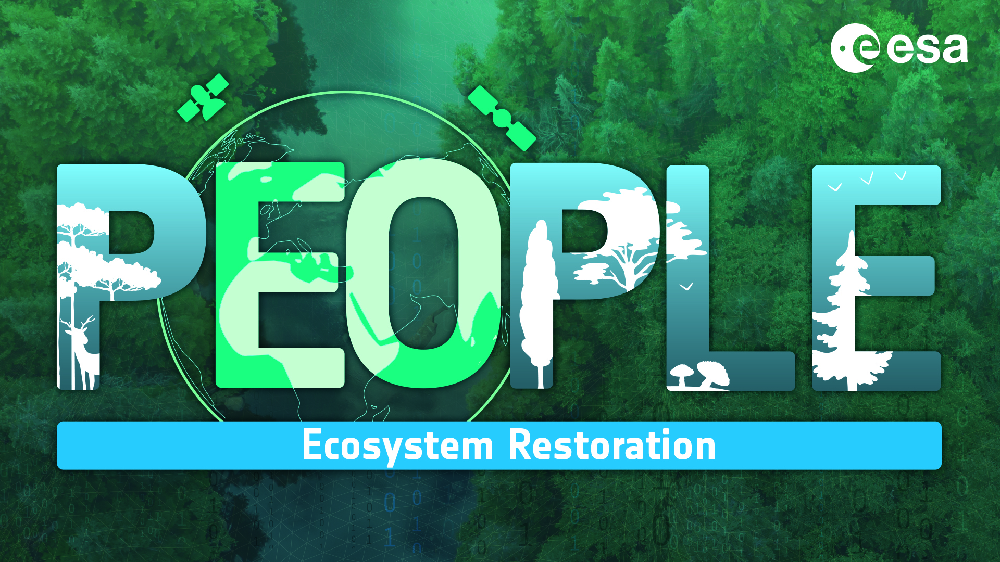
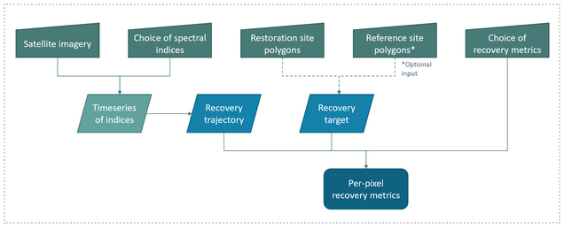

# Welcome to the PEOPLE-ER Spectral Recovery Docs!

{align=center}

**Authors:**

Sarah Zwiep

Melissa Birch

Marcos Kavlin

**Reviewed/Edited by:**

Dr. Andy Dean

Dr. Nicholas Coops

## Problem Statement:

Climate change effects are resulting in growing ecosystem degradation from increased disturbances 
such as wildfire and pest outbreaks. Ecosystem restoration (ER), a critical element of nature-based 
solutions, aims to return a degraded ecosystem to a stable state or reference condition. ER is important 
to reverse biodiversity loss, enhancing resilience to further disturbances. The need for ER on a large 
scale has been recognized by the United Nations sustainable development agenda and as part of the 
UN Decade on Ecosystem Restoration (2021-2030).

ER success is measured by ecosystem recovery, usually determined by three categories of ecosystem 
characteristics: vegetation structure, biodiversity, and ecological functioning (Ruiz-Jaen and Mitchell Aide 2005).
Monitoring recovery is a challenge, as field-based measurements are impractical due to 
large spatial extents and a lack of resources and time. Field monitoring typically only occurs for short 
durations (<5 years), but studies have found resilience and recovery to occur on longer time scales 
(>10 years) (Pickell et al. 2016; Atkinson et al. 2022).

Remote sensing of ER offers a solution in continuous monitoring of large spatial and temporal extents. 
Free and open satellite observation programs such as Landsat and Sentinel-2 have increased ER 
monitoring potential (Wulder et al. 2012), with further development of spectral vegetation indices (VIs) 
and remotely sensed essential biodiversity variables (RS-EBVs). VIs and RS-EBVs enable the 
extraction of vegetation health and recovery metrics (Skidmore et al. 2021), subsequently allowing 
estimation of ecosystem vegetation structure, diversity, and functioning (Cabello et al. 2012; Cordell et 
al. 2017). 

Trajectory-based time series analysis exploits temporal patterns in spectral values, proving to be 
effective for detecting and monitoring abrupt and gradual changes in ecosystem conditions (Banskota 
et al. 2014). However, previous analyses tend to explore only one spectral value or index, limiting the 
understanding of recovery dynamics, while change detection algorithms can be complex, 
unapproachable, and set with context-specific parameters, limiting more widespread applications 
(Cohen et al. 2018). This presents a barrier for effective use and interpretation of remotely sensed data 
for ER monitoring.

## Objective:

The objective of the PEOPLE-ER Spectral Recovery tool is to provide an open source and multi-platform 
time series data analytics solution for both remote sensing research and ER monitoring purposes, which 
operates with freely available satellite imagery. It provides flexible methods for spectral recovery analysis, by providing users with the ability to select from a variety of spectral 
indices and recovery metrics as well as define reference or baseline conditions. The aim is to provide 
custom analyses ideal for widespread applications beyond site-specific contexts, with flexible reference 
conditions enabling direct integration with current ER initiatives and guidelines. The ability to calculate 
multiple per-pixel indices also provides remote sensing experts or researchers with the ability to easily 
produce spectrally derived products useful for further analysis. 

PEOPLE-ER aims to provide the tool such that monitoring of ER is more accessible to a variety of users, 
enabling computation of indices and metrics by users that do not necessarily have a background in 
remote sensing or computer science. In providing a singular solution, spectral time series analysis becomes
more approachable, increasing the opportunity to apply remote sensing techniques to ER monitoring.

## Table of Contents:

This documentation contains:

- 1) Inspect S1 Time-Series for an Area of Interest
- 2) Segment Landscape based on S2 Composites
- 3) Compile Time Series by Units of Analysis
- 4) Clustering and Reference Extraction
- 5) Comparing similarities between Time Series

## Workflow Diagram

## Demonstration Area

The area used for the tutorial of this tool is a disturbance polygon in Northern British Columbia.

## Acknowledgements

This tool was developed within the Pioneer Earth Observation apPlications for the Environment Ecosystem 
Restoration (PEOPLE-ER) project financed by the European Space Agency (ESA). Members of the PEOPLE-ER consortium include:

{align=center}

{align=center}

{align=center}

{align=center}

{align=center}

## How to Cite

When using this tool in your work we ask that you please cite the Spectral_Recovery tool as follows:

"Spectral Recovery method developed in the PEOPLE-ER Project, managed by Hatfield Consultants, and financed by the European Space Agency."

## License

 [Spectral Recovery Documentation](httpps://www.people-er.github.io/Spectral-Recovery) © 2023 by [PEOPLE-ER Project](people-er.info) is licensed under [Attribution-ShareAlike 4.0 International](http://creativecommons.org/licenses/by-sa/4.0/?ref=chooser-v1)