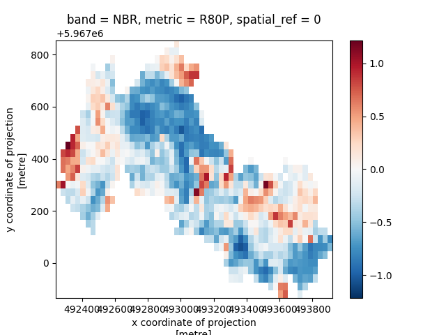

# Quick Overview

This page outlines a simple workflow for computing recovery metrics for a restoration site. For more detailed examples and in-depth explanations, see the [User Guide](https://PEOPLE-ER.github.io/Spectral-Recovery/terminology).

Begin by importing the spectral-recovery tool:

``` py
import spectral_recovery as sr
from spectral_recovery import data
```

## Define your Restoration Site

The spectral-recovery tool requires a spatial and temporal definition of your restoration site (i.e where is the site and when did the disturbance and restoration events occur?). 

Use the `read_restoration_sites` function to create your restoration sites. The function accepts two parameters: a path to a vector file containing site polygons (representing restoration sites) and a dictionary mapping a disturbance and restoration year to each polygon (e.g {0: [2007, 2008], 1: [2002, 2003]}). It returns a geopandas.GeoDataFrame. 

Each row in the returned GeoDataframe contains a unique restoration site, defined by a polygon, disturbance year, and restoration year. Multiple restoration sites can be defined at once, each with distinct years. Once read in, every restoration site can be uniquely identified and accessed by the index of the row it is in the Dataframe (i.e row 0 contains restoration site 0, row 1 contains restoration site 1, etc.).

``` py
rest_site = sr.read_restoration_sites(
    path=data.bc06_wildfire_restoration_site(),
    dist_rest_years={0: [2005, 2006]}
)
# Accessing restoration site 0
rest_site[0]
#    dist_start  rest_start                                           geometry
# 0        2005        2006  MULTIPOLYGON (((493414.458 5966949.912, 493414...
```

## Read in Timeseries Data

The spectral-recovery tool also requires a timeseries of optical satellite imagery or spectral indices covering the extent of your restoration sites. This is the spectral data from which disturbance, recovery, and reference values will eventually be derived. Each image in the timeseries should represent a unique year and it is strongly reccomened, but not required, that each image be a composite of multiple images to better account for temporal variation. 

If your timeseries of images are written to disk, the `read_timeseries` function can read the images from a directory path or dictionary of file paths into an xarray.DataArray, adding appropriate dimension labels and spatial attributes.

An image can contain spectral bands or spectral indices. If spectral bands are read in, the next section demonstrates how to compute spectral indices from spectral bands. If spectral indices are read in, then continue on with the spectral-recovery workflow.

``` py
ts = sr.read_timeseries(
    path_to_tifs=data.bc06_wildfire_landsat_bap_timeseries(),
    band_names={1: "blue", 2: "green", 3: "red", 4: "nir", 5: "swir16", 6: "swir22" }
)
ts
# <xarray.DataArray (band: 6, time: 23, y: 34, x: 56)> Size: 2MB
# dask.array<getitem, shape=(6, 23, 34, 56), dtype=float64, chunksize=(1, 1, 34, 56), chunktype=numpy.ndarray>
# Coordinates:
#   * x            (x) float64 448B 4.923e+05 4.923e+05 ... 4.939e+05 4.939e+05
#   * y            (y) float64 272B 5.968e+06 5.968e+06 ... 5.967e+06 5.967e+06
#     spatial_ref  int32 4B 0
#   * time         (time) datetime64[ns] 184B 2006-01-01 2007-01-01 ... 2017-01-01
#   * band         (band) <U2 48B 'B' 'G' 'R' 'N' 'S1' 'S2'
# Attributes:
#     AREA_OR_POINT:  Area
#     scale_factor:   1.0
#     add_offset:     0.0
```


## Compute Indices

Recovery metrics for restoration sites are computed using spectral indices, which can act as proxies for vegetation health and characteristics. If your timeseries is composed of spectral bands, use the `compute_indices` function to compute spectral indices. The spectral indices you choose should depend on which [ecosystem or vegetation characteristics](https://people-er.github.io/spectral-recovery/spectral_recovery_tool/#333-spectral-indices) you are interested in monitoring within your restoration sites.

!!! info

    spectral_recovery uses the modern spectral index catalogue [Awesome Spectral Indices](https://awesome-ee-spectral-indices.readthedocs.io/en/latest/) to support computation of 100+ vegetation and burn indices. Since 100+ choices can be overwhelming, a smaller list of "core" indices, indices that have been proven effective in previous spectral recovery research, is provided [here](https://PEOPLE-ER.github.io/Spectral-Recovery/spectral_recovery_tool/#333-spectral-indices). 

``` py   
indices = sr.compute_indices(ts, indices=["NBR", "GNDVI", "SAVI"])
indices
# <xarray.DataArray (band: 3, time: 23, y: 34, x: 56)> Size: 1MB
# dask.array<concatenate, shape=(3, 23, 34, 56), dtype=float64, chunksize=(1, 1, 34, 56), chunktype=numpy.ndarray>
# Coordinates:
#  * x            (x) float64 448B 4.923e+05 4.923e+05 ... 4.939e+05 4.939e+05
#  * y            (y) float64 272B 5.968e+06 5.968e+06 ... 5.967e+06 5.967e+06
#  * time         (time) datetime64[ns] 184B 2002-01-01 2003-01-01 ... 2024-01-01
#  * band         (band) <U5 60B 'NBR' 'GNDVI' 'SAVI'
#    spatial_ref  int32 4B 0
```

## Compute Recovery Targets

Some recovery metrics require a recovery target, which are the desired spectral characteristics of your resoration site. A novel feature of `spectral-recovery` is that it allows users to choose between using a [historic recovery target](https://people-er.github.io/Spectral-Recovery/about/#14-recovery-targets) or a [reference recovery target](https://people-er.github.io/Spectral-Recovery/about/#14-recovery-targets) when computing recovery metrics. Be sure to consult the user guide and current literature when deciding which type of target works best for your restoration needs.

!!! tip

    Only Y2R and R80P require recovery targets. If you are not computing these metrics, you can skip computing a recovery target and do not use the `recovery_target` parameter in `compute_metrics` (default is None).

The spectral_recovery tool provides 3 built-in functions to faciliate recovery target computation. 

### Historic Recovery Targets

When computing historic recovery targets, a unique set of recovery targets will be returned for each restoration site passed to the function. The recovery targets are returned in a dictionary of xarray.DataArrays. The keys for the dictionary are the restoration site IDs, e.g if there are two restoration sites (rs) passed, rs 0 and rs 1, the returned dictionary of recovery targets would be {0: <DataArray of rs 0 targets>, 1: <DataArray of rs 1 targets>}.

The first option to compute historic recovery targets is the `targets.historic.median` function. `targets.historic.median` computes the median of historic (pre-disturbance) values within each restoration site.

`targets.historic.median` can compute two difference scales of recovery target, polygon and pixel, passed through the `scale` parameter. `scale="polygon"` will return a single recovery target for the entire restoration site. `scale="pixel` will return a recovery target for every pixel in the restoration site.

``` py
hist_targets_med_poly = sr.targets.historic.median(
    restoration_sites=rest_site,
    timeseries_data=indices,
    reference_years={0: [2003, 2005]},
    scale="polygon"
)
hist_targets_med_pix = sr.targets.historic.median(
    restoration_sites=rest_site,
    timeseries_data=indices,
    reference_years={0: [2003, 2005]},
    scale="pixel"
)
hist_targets_med_poly
# {0: <xarray.DataArray (band: 3)> Size: 24B ... }
hist_targets_med_pix
# {0: <xarray.DataArray (band: 3, y: 33, x: 56)> ...}
```

The second historic recovery target function is `targets.historic.window` which first performs a moving window average to account for spatial variation, then derives historic median recovery targets from the averaged arrays. This function only returns targets at the polygon scale.

``` py
hist_targets_win = sr.targets.historic.window(
    restoration_sites=rest_site,
    timeseries_data=indices,
    reference_years={0: [2003, 2005]},
)
hist_targets_win
# {0: <xarray.DataArray (band: 3, y: 33, x: 56)> ... }
```

### Reference Recovery Targets

To compute a recovery targets based on reference systems, you will need to provide a path to vector file or a geopandas.DataFrame containing your reference site polygon(s). These are locations with ideal or desired characteristics in relation to your restoration site. The `targets.reference.median` function will take the median values across the reference system (site and years) and return a single recovery target value.

``` py
ref_targets = sr.targets.reference.median(
    reference_sites="reference_polygons.gpkg",
    timeseries_data=indices,
    reference_start="2022",
    reference_end="2023",
)
ref_targets
# {0: <xarray.DataArray (band: 3)> ... }
```

## Compute Recovery Metrics

Finally, once you've defined your restoration site, computed your indices, and derived your recovery targets, you can compute recovery metrics. `compute_metrics` will return recovery metrics for each given restoration site. The recovery metrics are returned in a dictionary of xarray.DataArrays. The keys for the dictionary are the restoration site IDs, e.g if there are two restoration sites (rs) passed, rs 0 and rs 1, the returned dictionary of metrics would be {0: <DataArray of rs 0 metrics>, 1: <DataArray of rs 1 metrics>}.

``` py
metrics = sr.compute_metrics(
    metrics=["Y2R", "R80P", "deltaIR"],
    restoration_sites=rest_site,
    timeseries_data=indices,
    recovery_targets=hist_targets_med_poly
)
metrics
# {0: <xarray.DataArray (metric: 3, band: 3, y: 33, x: 56)> Size: 133kB
# dask.array<concatenate, shape=(3, 3, 33, 56), dtype=float64, chunksize=(1, 1, 33, 56), chunktype=numpy.ndarray>
# Coordinates:
#   * x            (x) float64 448B 4.923e+05 4.923e+05 ... 4.939e+05 4.939e+05
#   * y            (y) float64 264B 5.968e+06 5.968e+06 ... 5.967e+06 5.967e+06
#   * band         (band) <U5 60B 'NBR' 'GNDVI' 'SAVI'
#   * metric       (metric) <U7 84B 'Y2R' 'R80P' 'deltaIR'
#     spatial_ref  int32 4B 0}
```

You can investigate individual metrics by selecting metric name from the metrics dimension

``` py
# Access restoration site 0's recovery metrics
rs_0_metrics = metrics[0]
r80p = rs_0_metrics.sel(metric="R80P").compute()
r80p
# <xarray.DataArray (band: 3, y: 33, x: 56)> Size: 44kB
# array( ... )
# Coordinates:
#   * x            (x) float64 448B 4.923e+05 4.923e+05 ... 4.939e+05 4.939e+05
#   * y            (y) float64 264B 5.968e+06 5.968e+06 ... 5.967e+06 5.967e+06
#   * band         (band) <U5 60B 'NBR' 'GNDVI' 'SAVI'
#     metric       <U7 28B 'R80P'
#     spatial_ref  int32 4B 0
```

Visualize recovery metrics over your restoration site using Xarray's `imshow` function

``` py
import matplotlib.pyplot as plt 

r80p.sel(band="NBR").plot.imshow()
plt.show()
```




or you can write metrics to file using the `rio.to_raster` function in the rioxarray extension:

``` py
r80p.rio.to_raster("r80p.tif")
```

## More Examples?

For more examples of the spectral-recovery tool, see our [notebooks](https://github.com/PEOPLE-ER/spectral-recovery/tree/main/docs/notebooks) or run them in a [Binder instance](https://mybinder.org/v2/gh/PEOPLE-ER/spectral-recovery/HEAD?labpath=docs%2Fnotebooks%2F)
